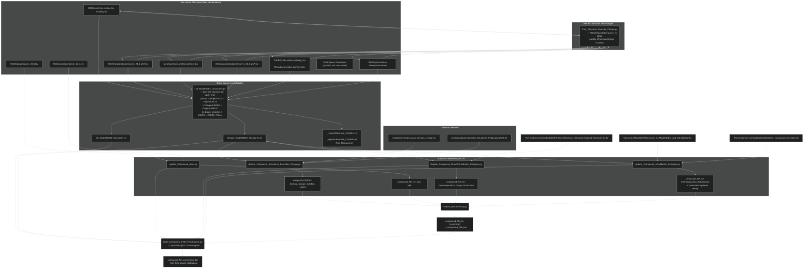

# ModelSEED Biochemistry Database Structures

We download molecular structures from KEGG, MetaCyc, ChEBI, and Rhea
(MetaNetX is also referenced for thermodynamics). For each source, we
keep the as-downloaded structure (InChI, SMILES, InChIKey) and one or
more protonated derivations produced by Marvin. Each protonation file
is a single bundle keyed by tool, version, and pH — adding a new pH or
upgrading Marvin means dropping a new file in `protonations/`, not
forking parallel files for every structure type.

## Per-source layout

```
Biochemistry/Structures/<source>/
  inchi.tsv             external_id, inchi, formula, charge
  smiles.tsv            external_id, smiles, formula, charge
  inchikey.tsv          external_id, inchikey
  protonations/
    <tool>_<ver>_ph<n>.tsv
                        external_id, type, structure, formula,
                        charge, tool, tool_version, ph,
                        generated_on
  pkas/
    <tool>_<ver>.tsv    external_id, kind, value, tool, tool_version
```

`sources.yaml` declares which protonation and pKa bundles each source
owns, and which are actually consumed by the production update scripts
today (KEGG and MetaCyc pKa data is consumed; ChEBI and Rhea pKa data
is present but not consumed — see the `todo` block in that file).

KEGG additionally keeps `KEGG_SRU_041020.txt`, a record of which mol
files contained structural repeating units that Marvin discards during
protonation.

## Pipeline

The diagram below shows how raw source dumps flow into the
`compound_NN.tsv` files. Each rectangle is a file (or per-source file
family); each rounded box is a script. Read it top-to-bottom: sources
arrive from outside, get derived per-source, get consolidated across
sources, and finally get applied to the canonical compound TSVs.



### Where to look when changing things

- **Editing a structure for a single compound.** Find the relevant row
  in the source-DB's `inchi.tsv` or `smiles.tsv` (for as-downloaded
  data) or `protonations/marvin_*_ph*.tsv` (for protonated data),
  edit, then re-run the pipeline. Use
  `Scripts/Structures/Preview_Structure_Update.py <cpd_id> <new_inchi>`
  to see which downstream fields will change before you commit.

- **Understanding why a particular field has its current value.** Look up
  the compound in the matching `compound_NN.provenance.tsv`. Each field
  carries a `<DB>:<external_id>[@stage]` pointer.

- **Following why a particular structure was *picked* in a conflict.**
  `Pick_Reasons.txt` records which branch of the picker cascade fired
  for each compound (single_structure, multi_source_agreement,
  smile_db_priority:KEGG, etc).

- **Adding a new protonation engine, pH, or Marvin version.** Drop a
  new file in `<source>/protonations/<tool>_<ver>_ph<n>.tsv` and add
  an entry to `sources.yaml`. The loader iterates everything in
  `protonations/`, so no other code has to move.
