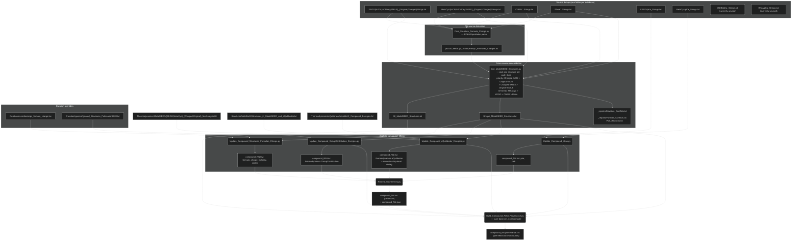

# ModelSEED Biochemistry Database Structures

Here we keep all the molecular structures we use for the ModelSEED
Biochemistry Database. We download and use molecular structures from
KEGG, MetaCyc and MetaNetX, each stored as SMILES, InChI, and InChIKey
representations in their own folder, and within the
`All_ModelSEED_Structures.txt` file.

We use Marvin to protonate each mol file at a pH of 7 cannot handle
every single file for various reasons, so all files that contain the
word "Original" were generated from the set of uncharged molecular
structure files that were downloaded from their respective sources,
and all files with the word "Charged" concern the files that were
sucessfully protonated by Marvin.

Marvin was also used to generate the pKas and pKbs of the atoms in
each molecular structure.

We also parsed the KEGG molecular structure files for SRUs (structural
repeating units). The information stored for these are passed over by
Marvin when protonating, and not repeated in the resulting output
structure. This caused problems when merging compounds that wre
clearly not the same compound, so we keep a record of which of the
KEGG molecular structure files contain these SRUs.

## Pipeline

The diagram below shows how raw source dumps flow into the
`compound_NN.tsv` files. Each rectangle is a file (or per-source
file family); each rounded box is a script. Read it top-to-bottom:
sources arrive from outside, get derived per-source, get consolidated
across sources, and finally get applied to the canonical compound
TSVs.

### Where to look when changing things

- **Editing a structure for a single compound.** Find the relevant row
  in the source-DB `*_OriginalStrings.txt` (or the protonated `*_ChargedStrings.txt`)
  for whichever DB owns that alias, then re-run the pipeline. Use
  `Scripts/Structures/Preview_Structure_Update.py <cpd_id> <new_inchi>`
  to see which downstream fields will change before you commit.

- **Understanding why a particular field has its current value.** Look up
  the compound in the matching `compound_NN.provenance.tsv`. Each field
  carries a `<DB>:<external_id>[@stage]` pointer.

- **Following why a particular structure was *picked* in a conflict.** After
  the next pipeline run, `Pick_Reasons.txt` records which branch of the
  picker cascade fired (single_structure, multi_source_agreement,
  smile_db_priority:KEGG, etc).

- **Adding a new protonation engine or pH.** Today this means forking new
  `*_ChargedStrings.txt` files, since the protonation method is encoded
  in the filename. See `sources.yaml` for the schema we are migrating
  toward, where protonation moves into a column.